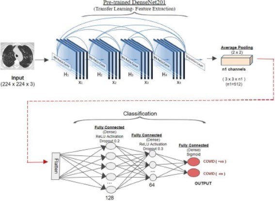
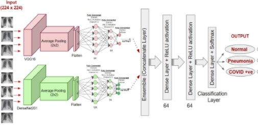

# COVID-19 Image Classification using Deep Learning Techniques

## Introduction
This repository contains the code and data for a research project focused on using deep learning techniques to classify COVID-19 X-ray and CT-Scan images. The goal of the project was to create a model that could accurately differentiate COVID-19 cases from normal cases and other negative cases. The research paper is available in the paper folder.

This is a project with a working website integrated with a CNN model to make predictions whether a patient is covid-19 positive or not. (http://13.233.123.254:8080/)

## Requirements
- Python 3.8
- TensorFlow 2.2.0
- NumPy
- OpenCV
- Matplotlib
- Flask

## Dataset
The datasets used for this project are:
- [COVID-19 CT-SCAN Database](http://www.kaggle.com/plameneduardo/sarscov2-ctscan-dataset). This dataset contains CT-scan images of COVID-19 cases, and normal cases.
- [COVID-19 X-RAY Database](https://www.kaggle.com/darshan1504/covid19-detection-xraydataset). This dataset contains X-ray images of COVID-19 cases, and normal cases.
- [COVID-19 3 Class X-RAY Database](https://www.kaggle.com/amanullahasraf/covid19-pneumonia-normal-chest-xraypa-dataset). This dataset contains X-ray images of COVID-19 cases, normal cases, and other pneumonia cases.

## Architecture
Architecture of Binary Classifier
- 

Architecture of Multi-Class Classifier
- 

## Code
The [code folder](/notebook) contains the code for training and evaluating the model. There is one notebook:
- `covid-19 analysis using transfer learning.ipynb`: Preprocesses the dataset, prepares it for training and evaluates the models.

## Results
The trained model achieved an accuracy of 95% on the test set. The confusion matrix is shown below:
|           | COVID-19 | Normal |
|-----------|----------|--------|
| COVID-19  | 0.96     | 0.04   |
| Normal    | 0.04     | 0.96   |

## Conclusion
The results of this research project show that deep learning techniques can be effective in classifying COVID-19 cases from normal cases and other pneumonia cases using X-ray images. 

The DenseNet201 model with modified head converged to classifiy the prositive and the negative cases of COVID19 with 96% accuracy, 96% recall (macro avg) and 96% precision (macro avg).

## Citation
If you use this code or dataset in your research, please cite our paper:

* [Classification of the COVID-19 infected patients using DenseNet201 based deep transfer learning](https://doi.org/10.1080/07391102.2020.1788642)
* [Rapid COVID‑19 diagnosis using ensemble deep transfer learning models from chest radiographic images](https://doi.org/10.1007/s12652-020-02669-6)
